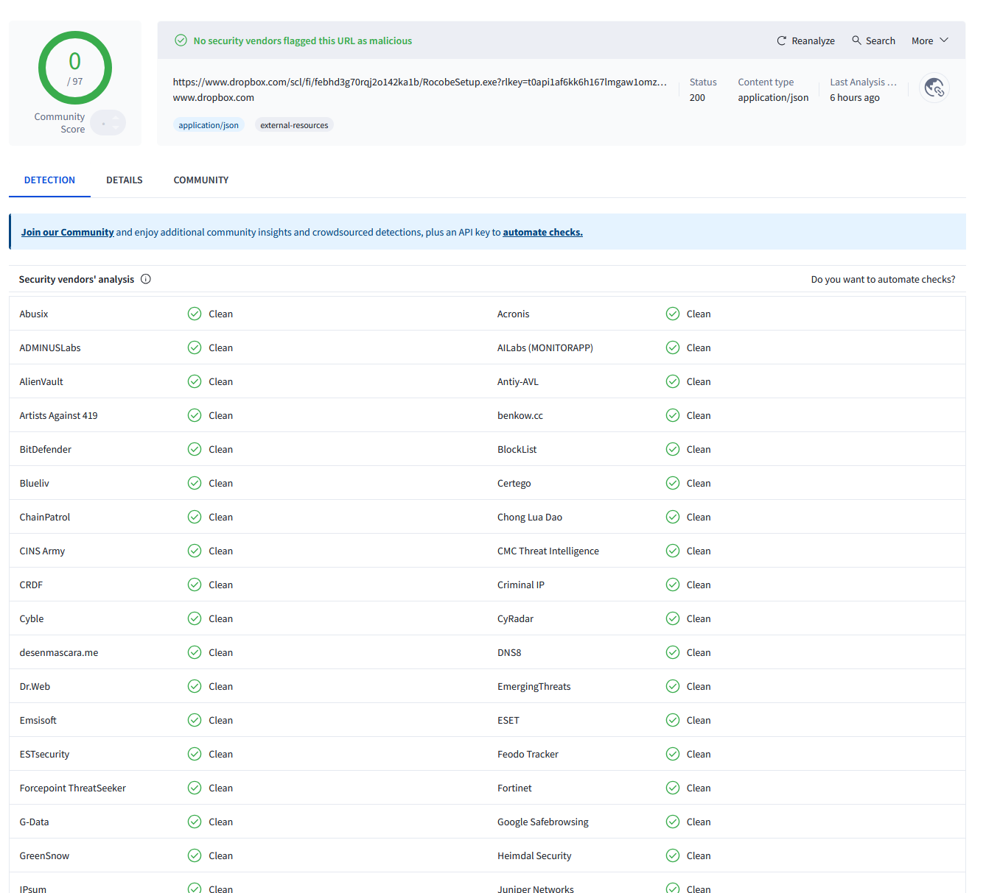
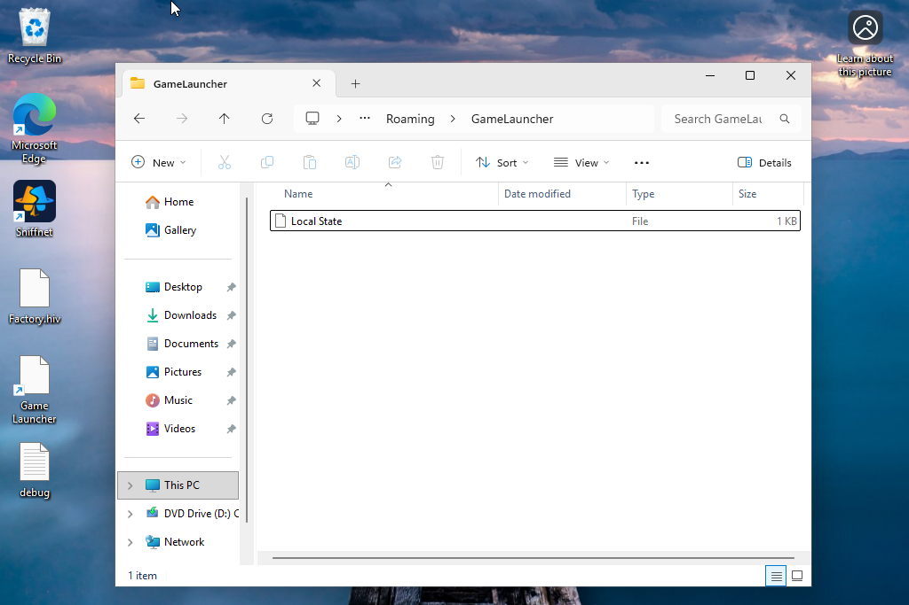
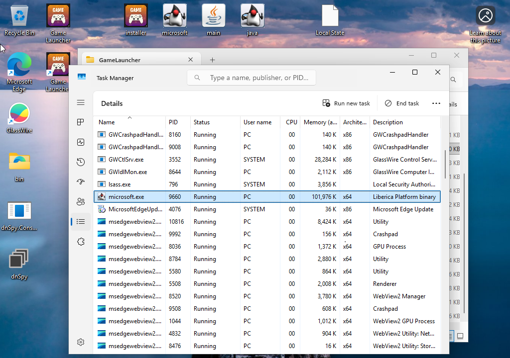
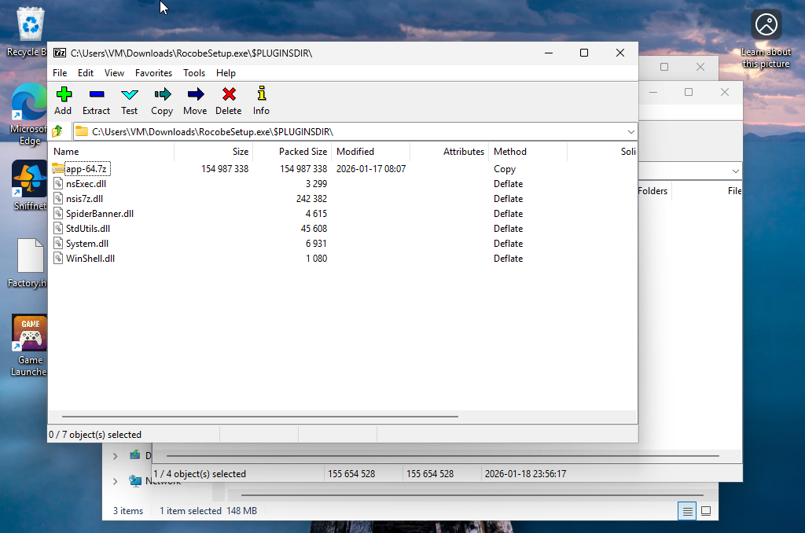
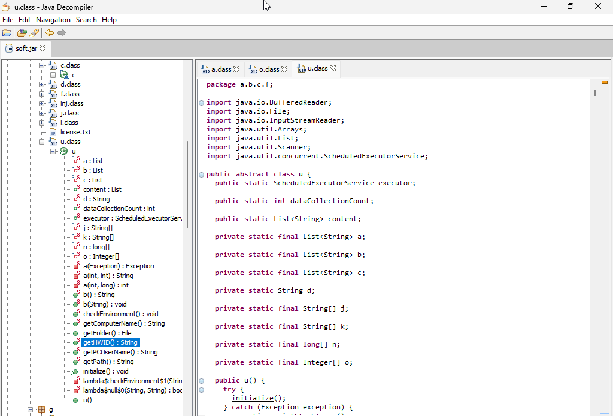
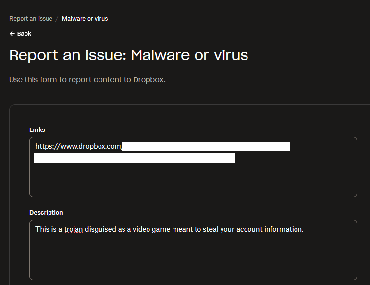

  <strong>The Malicious Landing Page:</strong> 
   
  <em>The fraudulent website used to distribute the malware. Note the high-quality design used to build trust.</em>

# "Try My Game" Malware Analysis (Electron/Java Credential Stealer)

## Preface: Why This Project Exists

This investigation started when a friend of mine was compromised on Discord. He received a DM asking him to playtest a game, followed a link, and installed what he thought was an indie project. He immediately lost access to his Discord account and left his PC compromised, to the point of factory reset.

I secured the malicious files from the incident to perform a full forensic analysis. My goal was to understand the attack chain, identifying how the malware bypasses standard detection, and report the infrastructure to protect others.

## Phase 1: The Lure and Website (OSINT)
The attack vector was a direct message linking to a professional-looking game website. The game used names like "Rocobe," "Mildors," "Velneria," or "Paventh."

I reverse-searched the images on the site and found they were stolen from a legitimate game called Inmost. The text on the site was also copied word-for-word from legitimate sources.

### Web Source Analysis
I inspected the source code of the landing page. It contained a malicious JavaScript function attached to the "Download" button. Even if a user did not complete the download, clicking the button triggered a script that scraped their IP address and system information, sending it directly to a Discord webhook.

## Phase 2: Dynamic Analysis
I set up an isolated test environment using VMware Workstation Pro running a barebones Windows 11 instance.

### Initial Scan and Execution
I uploaded the installer (Setup.exe) to VirusTotal. It returned a clean result with zero flags. This confirms that static scanning is not enough to detect new or repackaged variants of this malware.

   
  <em>VirusTotal failed to detect the sample initially (0/97 detections).</em>

Upon running the executable in the VM, I observed the following behavior:

-The installer ran without asking for Administrator privileges.

-It used the Squirrel.Windows framework, which allows silent installation in the background.

-It immediately forced the Microsoft Edge browser to close. This is a common tactic used to unlock browser database files (like Cookies) so they can be decrypted, read, and stolen.

   
  <em>The malware targeting the 'Local State' file to decrypt browser passwords.</em>

### File System Artifacts
The installer dropped several suspicious files into the AppData directory. The structure revealed this was an Electron application acting as a wrapper for the actual payload.
Key files identified:

-gamelauncher-updater.exe: The Electron wrapper.

-app-64.7z: An archive containing the application resources.

-miicrosoft.exe: A disguised "Liberica" platform binary used to run Java code.

-soft.jar: The core malicious payload.

   
  <em>'miicrosoft.exe' running as a disguised Java platform binary.</em>

   
  <em>The 'soft.jar' payload hidden inside the AppData folder.</em>

## Phase 3: Static Analysis and Reverse Engineering
Since the core payload was a Java .jar file (soft.jar), I used a Java Decompiler program (JD-GUI) to decompile the code and view the internal logic.

### Obfuscation and Evasion
The code was obfuscated using package names like a, b, c to hide functionality. However, I found specific checks designed to detect if the program was running inside a Virtual Machine. If a VM is detected, the malware often terminates to prevent analysis.

   
  <em>The internal structure of the Electron app archive.</em>

### Data Exfiltration Logic
I traced the code in the decompiled classes and found routines specifically targeting:
-Browser Data: Cookies, Autofill, History, and Passwords.

-System Info: Computer Name, Hardware ID (HWID), and Username.

   
  <em>Decompiled code explicitly listing "COOKIES, PASSWORDS, AUTOFILL".</em>

   
  <em>Code routine responsible for scraping Hardware IDs (HWID).</em>

The malware also attempted to ping a website by the name of "78smp", which is another credential stealer targeting Minecraft players.

## Phase 4: Attribution
Based on the file structure, the use of soft.jar, and the specific "MaaS" (Malware as a Service) template used for the website, this appears to be part of the Creal Stealer family.

I found comments and variable names in the source code hinting at Turkish origins, suggesting the template user may be based in that region.

Hybrid Analysis provided a much stronger detection rate than VirusTotal, identifying the behavioral fingerprints common in this malware family.

## Phase 5: Incident Response
After completing the analysis, I took the following steps to neutralize the threat:
-Cloudflare: Reported the website host for phishing and malware distribution.

-Dropbox: Reported the direct download link used for the payload.

-Google: Submitted the URL to Google Safe Browsing.

   
  <em>Confirmation of abuse report submission to Dropbox.</em>

### Lessons Learned

-Surface scans are unreliable. A 0/70 score on VirusTotal does not mean a file is safe. Behavioral analysis is required. Use of multiple services like Hybrid Analysis proved a much better solution.

-The danger of silent installers. Frameworks like Squirrel are convenient for developers but dangerous because they install to AppData without triggering a UAC prompt.

-Awareness is key! I cannot stress enough how social-engineering works! If you are asked to download a strange program/video game from somebody on a random website, DO NOT DO IT! 

-DO NOT engage any further if you suspect a phishing attempt, report and forward and move on.
